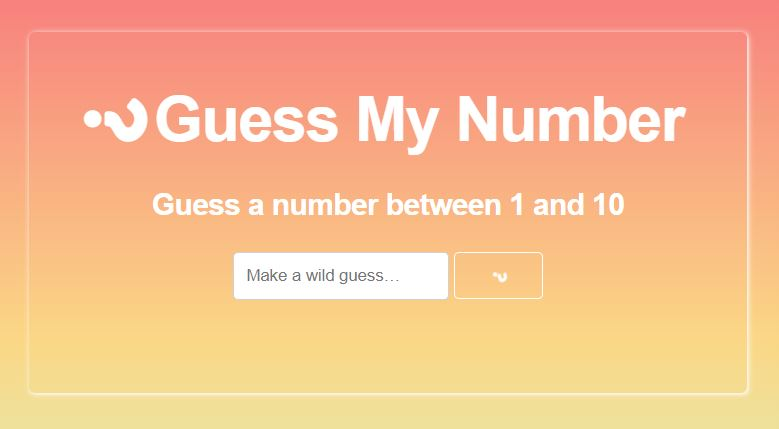

# guessMyNumber

*guessMyNumber* is a list app created under the direction of [Brad Traversy](https://www.udemy.com/modern-javascript-from-the-beginning/) in his *Modern JavaScript from the Beginning* course. The app uses the following technologies:

  * JavaScript
  * HTML
  * CSS
  * Skeleton

### Feature

Add more later.
