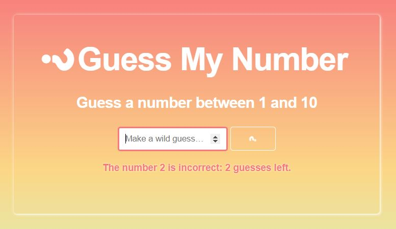
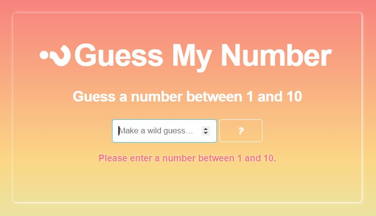
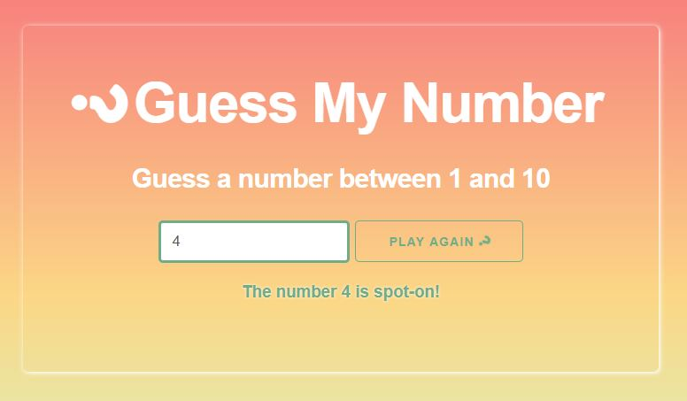

#  guessMyNumber

*guessMyNumber* is a game app created under the direction of [Brad Traversy](https://www.udemy.com/modern-javascript-from-the-beginning/) in his *Modern JavaScript from the Beginning* course. The app uses the following technologies:

  * JavaScript
  * HTML
  * CSS
  * Skeleton

### The Game

The app provides a player with three opportunities to correctly guess a randomly generated integer between a minimum and maximum value (all of which can be adjusted in `app.js` via the opening variables `min`, `max`, and `guessesLeft`). On entering an incorrect guess, a message displays stating as much, along with the number of guesses left for that game session.

### Error Handling

Empty guesses and guesses that fall outside the specified range return an error message to the player.

### Game Over

When that game session is finished, win or lose, the player is given the option to play again.

